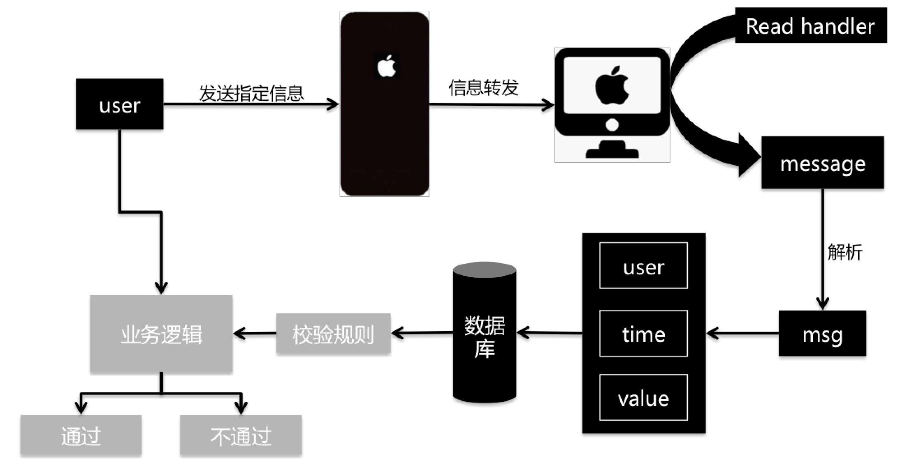

# 自动接收iphone短信

iOS对系统调用的限制很严格，对于非越狱的手机，我们能做的就是监听来电的状态、拨打电话、发送短信，但不能获取来电号码和接收短信。不过苹果提供了imessage可对信息进行转发，以此实现程序自动化。该方法类似将iphone和mac当作猫池使用。

主要结构如下（需要在iphone上开通信息转发）：

运行（可以拉去message到dat中的 uplink_msg.json（或数据库））

    python sms_uplink_ios.py

如：获取本地信息为

    {'user': '1069083223460101501', 'value': '【饿了么星选】美味与趣味不可多得，美食与美景不可辜负！送你13元红包，足不出户尽享美食~戳 dwz.cn/CV8U7fTa /退订回T', 'times': 1557633171}

运行（这里主要是接业务逻辑）

    python load_msg.py

**注：这种方式建议只用于测试环境，生产环境下很多性能都难以保证。**

