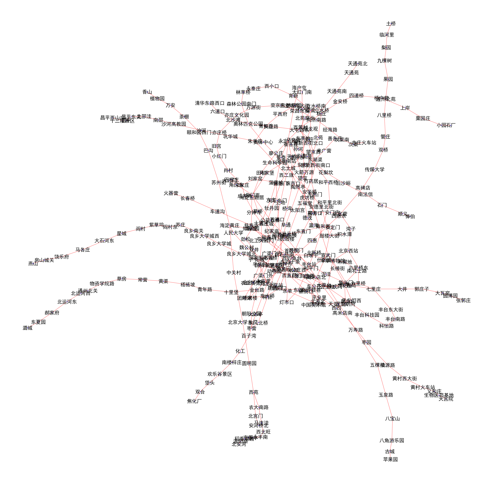

# 地铁中的图运算

北京地图可视化：

## 使用dijkstra算法计算最最短路径问题

西二旗 => 国贸

    [('西二旗', 0), ('上地', 2521.8190269305815), ('五道口', 7226.202498668589),
    ('知春路', 9061.66844715512), ('大钟寺', 10244.02863561409),
    ('西直门', 13280.017919957112), ('新街口', 14330.294523338045),
    ('平安里', 15196.453570496755), ('北海北', 16388.164723745893),
    ('南锣鼓巷', 17870.18685326683), ('东四', 19418.517204466436),
    ('朝阳门', 20876.103272476736), ('东大桥', 22340.93772453783),
    ('呼家楼', 23191.006983352196), ('金台夕照', 23913.7860131046), ('国贸', 24773.86124372499)]

