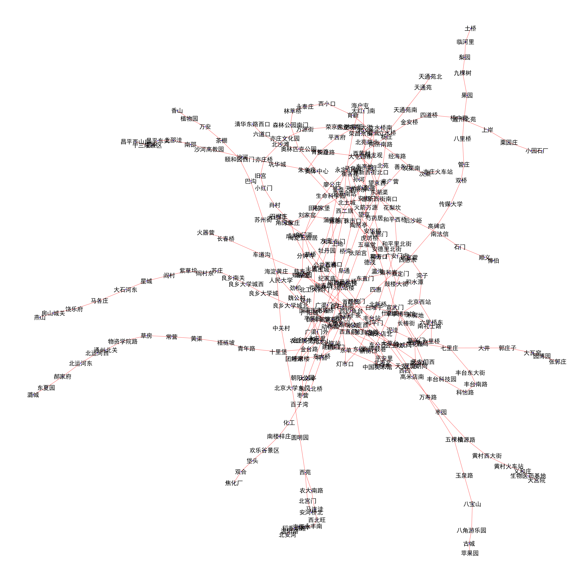

# 遍历北京地铁

## 加载库并设置中文字体


```python
# -*-coding:utf-8-*- 
%matplotlib inline
import json
import random
import time
import math
import numpy as np
import networkx as nx
import matplotlib.pyplot as plt
```


```python
# 设置中文字体（plt默认不支持中文）
plt.rcParams['font.sans-serif'] = ['SimHei']  # 中文字体设置
plt.rcParams['axes.unicode_minus'] = False
```

## 获取数据

国内baidu和高德都有地图数据api（具体api参数使用可见相应地图官网）

百度api http://map.baidu.com/?qt=bsi&c=131&t=1557640374739

高德api http://map.amap.com/service/subway?_1557640374739&srhdata=1100_drw_beijing.json

这里baidu地图数据与高德地图数据均已保存在本地，可直接读取（此处以高德地图数据示例）

### 经纬度距离转换


```python
def distance(lon1, lat1, lon2, lat2):
    """
    通过经纬度计算距离
    """
    # return np.sqrt(np.square(x_2 - x_1) + np.square(y_2 - y_1))
    lon1, lat1, lon2, lat2 = map(math.radians, [lon1, lat1, lon2, lat2])
    dlon = lon2 - lon1 
    dlat = lat2 - lat1 
    a = math.sin(dlat/2)**2 + math.cos(lat1) * math.cos(lat2) * math.sin(dlon/2)**2
    c = 2 * math.asin(math.sqrt(a)) 
    r = 6371.393 # 地球平均半径（千米）
    return c * r * 1000
```

### 解析百度地图数据


```python
with open("./dat/subway_bj_baidu.json","r") as load_f:
    subway_dic = json.load(load_f)
```


```python
# 拆分为序列
subway_line = []
for i in subway_dic["content"]:
    site_line = i["stops"]
    for j in range(len(site_line)-1):
        dis = distance(site_line[j]["x"], site_line[j]["y"], 
                       site_line[j + 1]["x"], site_line[j + 1]["y"])
        edge = (site_line[j]["name"], site_line[j + 1]["name"], dis)
        subway_line.append(edge)
```

### 解析高德地图数据


```python
with open("./dat/subway_bj_amap.json","r") as load_f:
    subway_dic = json.load(load_f)
```


```python
subway_line = []
k = 1
for i in subway_dic["l"]:
    site_line = i["st"]
    for j in range(len(site_line)-1):
        lng1, lat1 = map(float, site_line[j]["sl"].split(","))
        lng2, lat2 = map(float, site_line[j + 1]["sl"].split(","))
        dis = distance(lng1, lat1, lng2, lat2)
        edge = (site_line[j]["n"], site_line[j + 1]["n"], dis)
        subway_line.append(edge)
```


```python
subway_line[0:10]
```


    [('金安桥', '四道桥', 2626.0025093304116),
     ('四道桥', '桥户营', 808.5481551958499),
     ('桥户营', '上岸', 861.7094592137288),
     ('上岸', '栗园庄', 1044.3223017705857),
     ('栗园庄', '小园', 956.2650802792436),
     ('小园', '石厂', 1209.871129096451),
     ('苹果园', '古城', 2411.4083228554928),
     ('古城', '八角游乐园', 1906.2186163036702),
     ('八角游乐园', '八宝山', 1984.4394579069644),
     ('八宝山', '玉泉路', 1444.99704849566)]


## 地图可视化

这里使用networkx绘制，如果痛殴坐标绘制，会更像实际看到的地图


```python
plt.figure(figsize=(40, 40))
G = nx.Graph()
# l = [('你','我',5.0),('我','她',3.0),('你','她',1.0)]
G.add_weighted_edges_from(subway_line)
pos = nx.spring_layout(G)
nx.draw(G, pos, node_color='b', edge_color='r', 
        with_labels=True, font_size=30, node_size=10)
plt.show()

```





## 两站之间的最短距离

采用Dijkstra算法，调用写好的dijkstra.DijkstraPath


```python
from dijkstra import set_node_map
from dijkstra import DijkstraPath
```


```python
# 将 x, y, w转换成矩阵
node, node_map = set_node_map(subway_line)

# 从西二旗到国贸
from_node = '西二旗'
to_node = '国贸'
djs = DijkstraPath(node, node_map)
path = djs.get_path(from_node, to_node)
print(path)
```

    [('西二旗', 0), ('上地', 2521.8190269305815), ('五道口', 7226.202498668589), ('知春路', 9061.66844715512), ('大钟寺', 10244.02863561409), ('西直门', 13280.017919957112), ('新街口', 14330.294523338045), ('平安里', 15196.453570496755), ('北海北', 16388.164723745893), ('南锣鼓巷', 17870.18685326683), ('东四', 19418.517204466436), ('朝阳门', 20876.103272476736), ('东大桥', 22340.93772453783), ('呼家楼', 23191.006983352196), ('金台夕照', 23913.7860131046), ('国贸', 24773.86124372499)]

